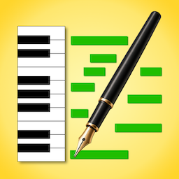
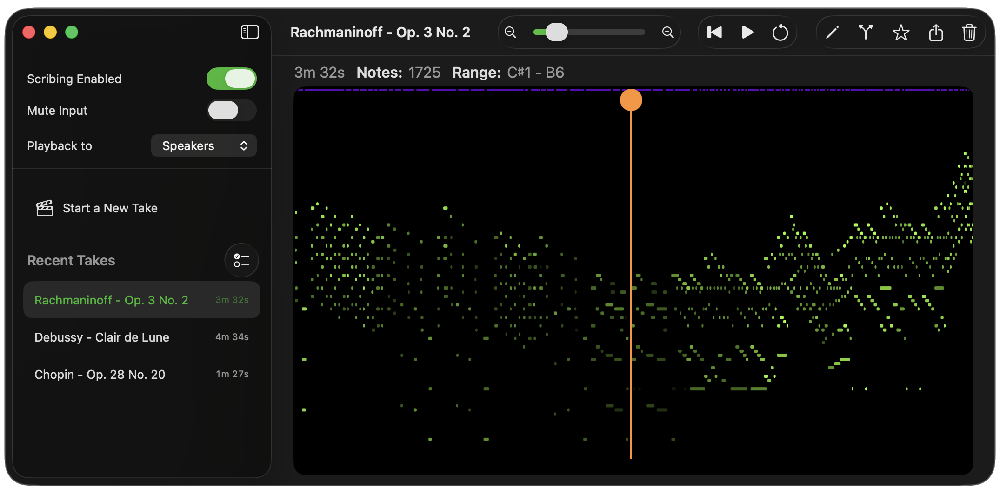
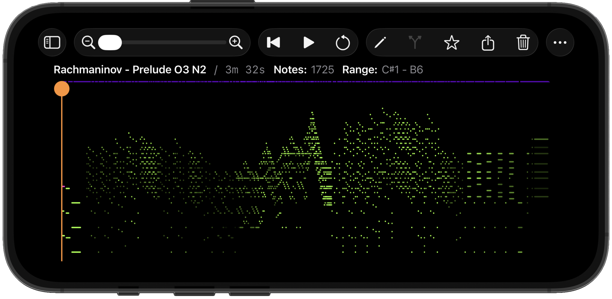

#  MIDI Scribe™ 

A practice take auto-capture utility for MIDI-capable instruments supporting macOS, iPad and iPhone.

MIDI Scribe is [available in the App Store](https://apps.apple.com/us/app/midi-scribe/id6760952962), while macOS builds can also be downloaded directly from [this project's releases](https://github.com/centennial-oss/midi-scribe/releases).

## About

MIDI Scribe is a free plug-and-play productivity app for automatically capturing and organizing practice takes from your MIDI-capable musical instrument. Run it in the background while you practice, and it will automatically start new takes after every session break, with a configurable auto-take idle time, as well as support for specific MIDI commands (such as a middle or left piano pedal press) to manually start and end takes. A piano roll is provided to review and scrub individual takes. Star the takes that you want to keep indefinitely, while unstarred takes are garbage-collected over time based on a configurable retention policy. All takes can be exported as MIDI files for use in other programs like GarageBand or Logic Pro.

The app is completely private. Connect your instrument, capture your takes, and keep everything on your device for personal review. No ads, no analytics, no snooping on your usage, and nothing ever leaves your device.

MIDI Scribe is completely free and open source for you to enjoy.

## Screenshots

 

## Supported MIDI Devices

Any General MIDI device that can connect to your Mac, iPad, or iPhone and be recognized by the operating system is compatible with MIDI Scribe.

## Privacy

MIDI Scribe does not collect, send, or share usage data. Digital instrument captures stay local and never leave your device. The app is open source, contains no ads, trackers or analytics, and makes no network calls.

Read the full [Privacy Policy](./PRIVACY.md) for more info.

## Requirements

### Running

- Apple Silicon device
- macOS 15 or higher, or iOS 18 or higher
- A connected external MIDI device
  - Sample take data is available via app Settings for evaluation of non-capture features

### Developer

- Apple Silicon-based Mac computer with Xcode 26.4 or higher, including Command Line Tools

## Building

1. Open `MIDI Scribe.xcodeproj` in Xcode.
2. Build and run.

## Tech Stack

- SwiftUI
- AVFoundation
- AppKit
- UIKit

## Contributor Disclosure

Humans write this software with AI assistance. All contributions are well-tested and merged only after being reviewed and approved by humans who fully understand and take responsibility for the contribution.

While we welcome pull requests and other contributions from other humans, including AI-generated code, we do not accept contributions from AI bots. A human must review, understand, and sign off on all commits. Please file an issue to discuss any proposed feature before working on it.

## Acknowledgements

### GeneralUser GS SoundFont Bank / S. Christian Collins

We gratefully make use of the [GeneralUser GS](https://github.com/mrbumpy409/GeneralUser-GS/) v2.0.3 sound bank, which was created and has been maintained by the amazing [S. Christian Collins](https://www.schristiancollins.com/) for over 30 years. Without Chris's lifelong dedication to curating free synthesizer sounds for anyone who needs them, MIDI Scribe would not be able to produce realistic instrument sounds on iPhone and iPad. Please [buy Chris a coffee](https://buymeacoffee.com/schristiancollins).

### Sample Take Files / Alexander Peppe

We have baked three classical music sample take files into the app. They can be reviewed in the [testdata](./testdata/) directory and loaded into MIDI Scribe directly from Settings in a single click. These files come from a vast catalog of public domain MIDI works that is generously and meticulously curated by [Alexander Peppe](https://alexanderpeppe.com/). If you live in Maine, Alex should be tuning your piano. And if you are into ham radio, his 4-digit callsign (WS1Q) should tell you a lot about his cool factor.

## Trademark Notice

MIDI Scribe and its logo are trademarks of Centennial OSS Inc. Use of the name and branding is not permitted for modified versions or forks without permission. See TRADEMARKS.md for details.
